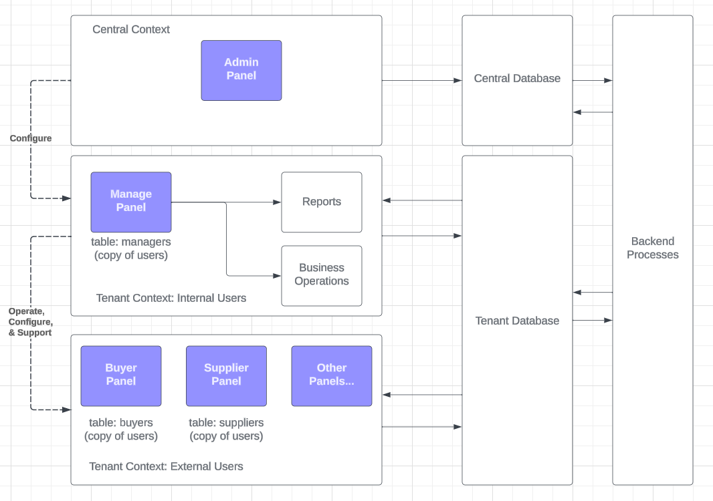

# CDI Nexus

## Description

This is a Laravel 10+ project that incorporates numerous components with the aim of providing 
a scaffold for micro-Saas applications.

## TOP OPEN ISSUES

- [ ] Tenant-Space Customization: Headlines and other details
    - Colors are good, but we need more ability to customize.
    - Add logo upload support. Do not store locally.
        - Use minio locally, s3 in cloud.
        - setup flysystem

## Architecture

Summary: Laravel 10 + Filament v3 + Stancl/Tenancy

If you'd like to see the rationale behind these choices, please see the Architectural Decision 
Records in the `adr` folder.

### Phase One: MVP (Monorepo & Monolith)

Nexus is a monolithic application with both front and back end services. It delivers the
Admin and Manage panels as well as comprehensive documentation on setting up and running
this app. 

Documentation is provided for users to create and segregate new panels and understand the
underlying architecture of the application.

The app consists of individual docker containers: App, Database, Cache, Utility. We use Laravel
Sail for local development.

### Phase Two: Growing Up

Build a Nexus-friendly control plane application. This will allow user impersonation, support
tickets/chat, tenant migration to new hardware, backup/restore on a per-tenant basis, and other 
features needed to operate as a service provider. This should also include revenue reporting
and forecasting and some level of application analytics around usage of the platform. 

## Feature List

- [x] [Domain-Based Multi-Database Multi-Tenancy](https://tenancyforlaravel.com/docs/v3/)
- [x] [Filament v3](https://filamentphp.com/docs) Control Plane (Central Context)
- [x] [Filament v3](https://filamentphp.com/docs) Application Plane (Tenant Context)
- [x] [Laravel Telescope](https://laravel.com/docs/10.x/telescope)
- [x] [Laravel Horizon](https://laravel.com/docs/10.x/horizon)
- [x] [Laravel Pulse](https://pulse.laravel.com/)
- [x] [Authentication Logs & Notifications](https://rappasoft.com/docs/laravel-authentication-log/v1/introduction)
- [x] [Model Change Audits](https://laravel-auditing.com)
- [x] [Model Tagging](https://spatie.be/docs/laravel-tags/v4/introduction)
- [x] [User Roles & Permissions](https://spatie.be/docs/laravel-permission/v6/introduction)
- [ ] Custom Artisan Helper Commands
- [ ] Stretch Goal -- IAC (Infrastructure as Code) with Terraform
    - [ ] S3 Buckets
    - [ ] CloudFront Distributions
    - [ ] Route53 DNS Records
    - [ ] ACM Certificates
    - [ ] ECS Cluster, Task Definitions, Services
    - [ ] RDS Database
    - [ ] Redis Cache
    - [ ] SNS Topics
    - [ ] SQS Queues
- [ ] Stretch Goal -- CI/CD with GitHub Actions
    - [ ] Deploy Terraform Infrastructure
    - [ ] Build & Deploy Application

## Installation

### Requirements

Docker Desktop (MacOS, Windows, Linux) or Docker Engine (Linux)

### Steps

#### Prerequisites

#### Method 1: setup.sh

Instead of having to run all of the commands below, you can clone the repo, then
run `./setup.sh` from the root directory. This will run everything after the clone
operation, and install a pre-commit hook for Pint styling. You'll also get the
option to install some bash aliases to make working with Sail easier.

#### Method 2: Manual

    git clone (your ssh key):/clouddotinc/nexus
    cd nexus
    docker run -v $(pwd):/app composer:latest install --ignore-platform-reqs
    cp .env.example .env

    (edit .env)

    ./vendor/bin/sail up -d
    ./vendor/bin/sail composer install
    ./vendor/bin/sail artisan migrate:fresh --seed
    ./vendor/bin/sail npm install
    ./vendor/bin/sail npm run dev

## Usage

This is a standard Laravel 10 + Filament application with a minimal set of
customizations. I make use of `stancl/tenancy` for multi-tenancy. This package
bootstraps most connections/resources so that they are tenant-aware. This
means that database connections, queues, jobs, events, etc, are all scoped
to the client.

### User Aliases & Purpose

Nexus is a multi-dashboard solution with the same underlying database. This
As an example implementation, we provide Admin and Manage dashboards.

The Admin dashboard is the central context. It is used for initial sign-up,
subscription management, and creation of tenant & domain environments. These
people are referred to as Administrators and will use an `adminsitators`
table with the same initial schema as the `users` table. A custom guard is
used to authenticate these users.

The Manage dashboard is in the tenant context, and is where people will
spend most of their time, using the functionality provided by the application.
People in the Manage dashboard authentication context are referred to as
Managers. They will use a `managers` table with the same initial schema
as the `users` table. A custom guard is used to authenticate these users.

If we create a dashboard called Buyer, then people in the Buyer dashboard
authentication context are referred to as Buyers. They will use a `buyers`
table with the same initial schema as the `users` table. A custom guard is
used to authenticate these users.

### Tenancy & Storage

Because of the way that `stancl/tenancy` works, we need to make sure that
when storing & retrieving tenant assets, we include `$tenant->id` in the
path. (The tenancy package can do this automatically, but it introduces
some undesirable behavior with Filament assets, so I've opted to do it
manually.)

- [ ] TODO: figure out how to make this work with the tenancy package; there 
may be a way to block certain paths from being rewritten.

